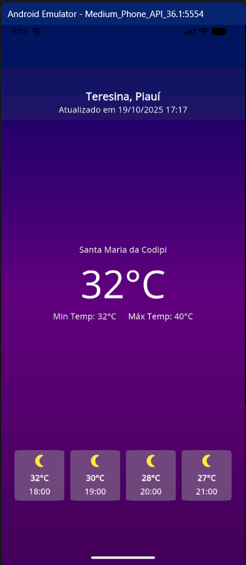

# Climate App

Aplicativo de previsão do tempo utilizando a [Weather Forecast API](https://open-meteo.com/).

## Tecnologias

 &nbsp;&nbsp;&nbsp;&nbsp; 


## Get Started

No seu teminal [cmd ou bash]:

Crie um clone do repositório:
```
git clone https://github.com/devdouglasa/climate-app.git
```

Entre na pasta do projeto:
```
cd climate-app
```

Rode o app:
```
flutter run
```


## Imagens



<br>

#
### Desenvolvido por devdouglasa